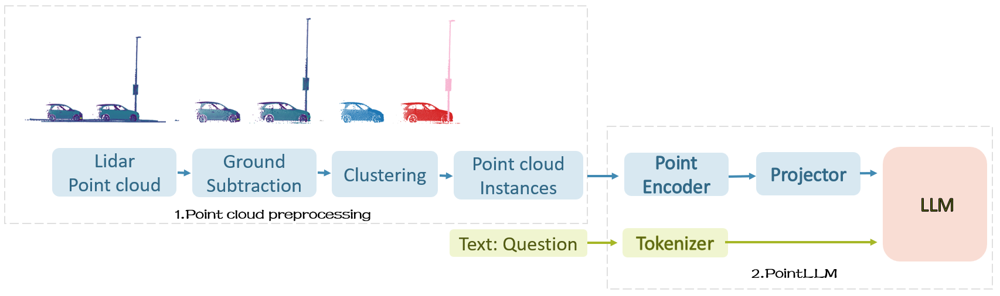
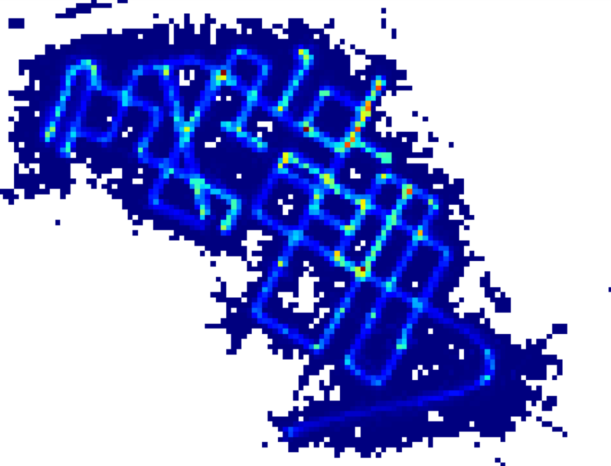
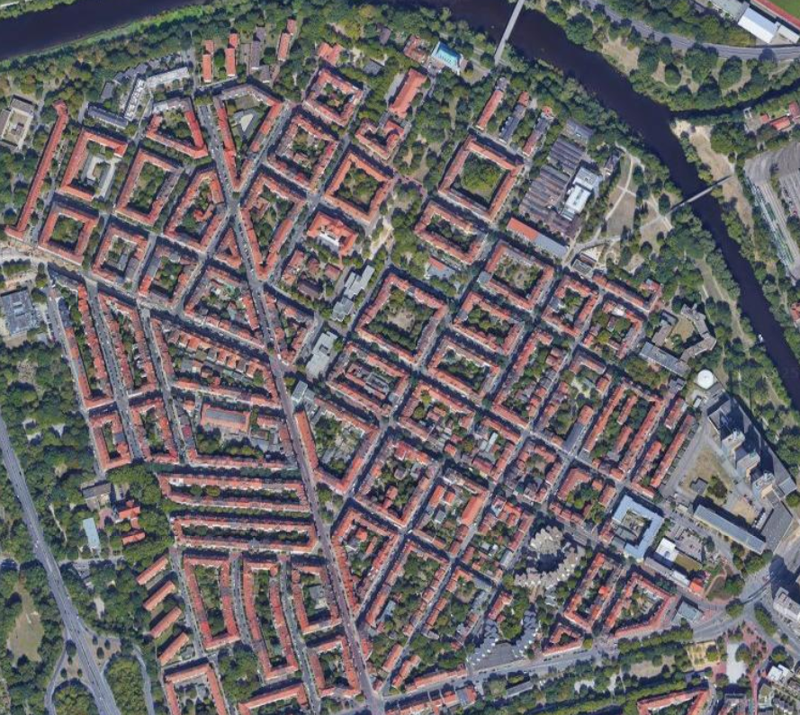
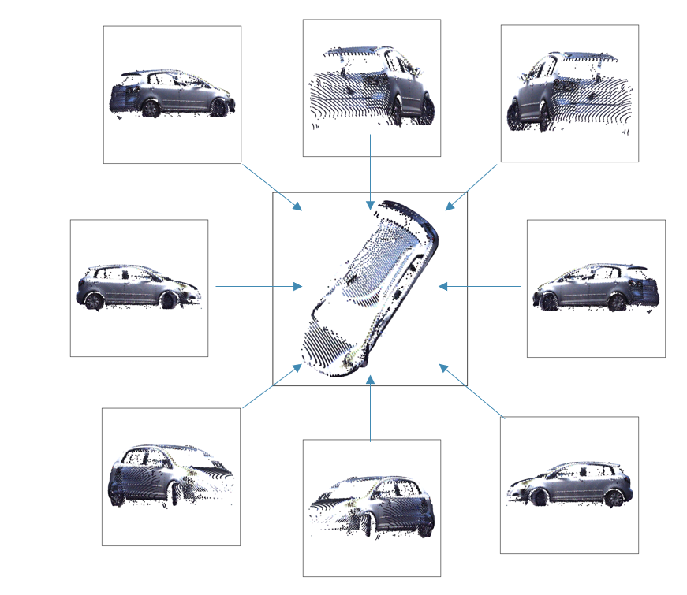
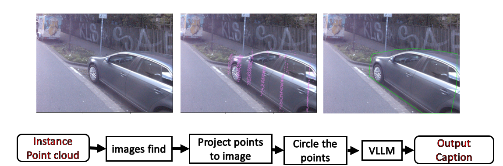

# MMS-LLM
<br>
<p align="center">
<h1 align="center"><strong>MMS-LLM: Empowering Large Language Models to Understand LiDAR Point Clouds</strong></h1>
  <p align="center">
    <a href='https://github.com/TingdeLiu/' target='_blank'>Tingde Liu, M. Sc</a>&emsp;
    <a href='https://www.ikg.uni-hannover.de/de/leichter/' target='_blank'>Artem Leichter , M. Sc.</a>&emsp;
    <br>
    Institut für Kartographie und Geoinformatik&emsp;Leibniz Universität Hannover
  </p>
</p>


## 🏠 About

We introduce <b>MMS-LLM, a multi-modal large language model capable of understanding LiDAR point clouds of objects.</b> It perceives object types, geometric structures, and appearance without concerns for ambiguous depth, occlusion, or viewpoint dependency. This study aims to improve PointLLM’s ability to process LiDAR point clouds without relying on color information. We used typical laser scanning information (Intensity) to replace the missing color details in LiDAR point clouds. We designed a framework to automatically extract point cloud instances and generate text instructions. Using this framework, we created a new dataset with 4.1K LiDAR point cloud instances, 4.1K simple point-to-text instruction pairs, and 3.6K complex instruction pairs. Through this dataset, we fine-tuned the LLM. To rigorously evaluate the perceptual and generalization
capabilities of the fine-tuned LLM, we employed an evaluation method based on GPT-4/ChatGPT. Experimental results demonstrate that our trained MMS-LLM 7B v1 outperforms the existing PointLLM 7B v1.2 in handling LiDAR point cloud data.

## 🔥 News

- [2025-03-11] We have released the code for data generation and training. You can use this code to create your own dataset.


<!-- contents with emoji -->
## 📋 Contents
- [💬 Dialogue Examples](#-dialogue-examples)
- [🔍 Overview](#-overview)
- [📦 Training and Evaluation](#-training-and-evaluation)
- [📚 Related Work](#-related-work)
- [👏 Acknowledgements](#-acknowledgements)


## 💬 Dialogue Examples
| Dialogue 1 | 
|  |  

## 🔍 Overview

### Model
<p align="center">
  
</p>
To enhance PointLLM’s capability and extend it to handle complex LiDAR point clouds,we designed a new framework MMS-LLM, as illustrated in Fig.  This framework consists of two main parts: the point cloud preprocessing module and PointLLM module.The preprocessing module includes Ground Subtraction and Clustering steps. With this framework, we enable the MLLM to understand complex scene-level point clouds and generate accurate and meaningful textual descriptions. The point encoder extracts features from the input point cloud and projects them to the latent space of the LLM backbone. The LLM backbone processes sequences of point tokens and text tokens, and generates the predicted tokens as the output.

### Experiment Results
#### Quantitative Comparisons with baselines.
Please refer to our paper for more results.
<p align="center">
  
</p>
Table presents the performance of our model, MMS-LLM 7B v1, compared to PointLLM 7B v1.2
and the control group Reference 7B v1 on the ikgc17 test dataset. As shown in the table,
our model, MMS-LLM 7B v1, demonstrates excellent performance in handling LiDAR
point cloud data, outperforming PointLLM 7B v1.2 in both classification and captioning
tasks. This indicates that our targeted fine-tuning of the projector and LLM significantly
improved the model’s performance on LiDAR point cloud tasks.

#### Qualitative Comparisons with baselines.
Please refer to our paper for more results.
<p align="center">
  
</p>

## 📦 Training and Evaluation
### Installation
We test our codes under the following environment:
- Ubuntu 20.04
- NVIDIA Driver: 515.65.01
- CUDA 11.7
- Python 3.10.13
- PyTorch 2.0.1
- Transformers 4.28.0.dev(transformers.git@cae78c46)

To start: 
1. Clone this repository.
```bash
git clone https://github.com/TingdeLiu/MMS-LLM.git
cd PointLLM
```
2. Install packages
```bash
conda create -n mmsllm python=3.10 -y
conda activate mmsllm
pip install --upgrade pip  
pip install -e .

# * for training
pip install ninja
pip install flash-attn
```

### Data Preparation
This dataset, used in MMS-LLM, comes from the Institute of Cartography and Geoinformatics (IKG). IKG researchers continuously collect urban data in Hanover using an MMS system, which includes two laser scanners, two cameras, and an IMU/GNSS device. The dataset, collected in the Linden-Nord district, contains approximately 0.9 billion points. Raw point cloud data was colored and enriched with semantic labels via label transfer.
<p align="center">
  
  
</p>

#### Training Data generieren
##### 1. Semantic segmentation.
The image below shows the visualization of one of the point clouds.
<p align="center">
  
</p>

```bash
cd create_dataset/pointcloud
python semantic.py
```
##### 2. Instance segmentation.
Inspired by [Leichter et al., 2021](https://isprs-archives.copernicus.org/articles/XLIII-B2-2021/185/2021/), we propose an instance extraction strategy. Our workflow, shown in the image below, consists of four sequential processing steps.
<p align="center">
  
</p>

```bash
cd create_dataset/pointcloud
python instance.py
```
##### 3. Point cloud images from different viewpoints generate.
Inspired by [Cap3D](https://arxiv.org/abs/2306.07279), we collect point cloud projections from different viewpoints.
<p align="center">
  
</p>

```bash
cd create_dataset/instruction
python project.py
```
##### 4. Annotated MMS images generate:.
Inspired by [Automatic Generation of Large Point Cloud Training Datasets Using Label Transfer ](https://www.ikg.uni-hannover.de/de/institut/personenverzeichnis/peters/publikationen/publikationen-detail?tx_t3luhpublications_publications%5Baction%5D=show&tx_t3luhpublications_publications%5Bcontroller%5D=Publication&tx_t3luhpublications_publications%5Bpublication%5D=10493&cHash=5d805fd97b8c7bce82707a64d3d183d4), we point cloud projected onto the Street View HD image.
<p align="center">
  
</p>

```bash
cd create_dataset/instruction
python get_image-full.py
```
##### 5. Caption transform.
```bash
cd create_dataset/instruction
python transform.py
```
##### 6. complex instruction generate.
Hier we use InternVL to generate the complex instructions.
```bash
cd create_dataset/instruction
python complex_instruction_generate.py
```
#### Instruction-Following Data
1. In `PointLLM/data` folder, create a directory named `anno_data`.
2. Our instruction-following data, including both the simple-description and complex instructions.
- The simple-description data has 4K samples and the complex instructions have 3.6K samples.
- Both training data are based on the ikgc17 dataset.
- The complex instructions are generated with InternVL.
3. Put the data files in the `anno_data` directory. The directory should look like this:
```bash
PointLLM/data/anno_data
├── ikgc17_brief_description_filter.json
├── ikgc17_brief_description.json
└── ikgc17_complex_instruction.json
```
4. Note, the `ikgc17_brief_description_filter.json` is filtered from `ikgc17_brief_description.json` by removing the 262 objects we reserved as the validation set. If you want to reproduce the results in our paper, you should use the `ikgc17_brief_description_filter.json` for training. The `ikgc17_complex_instruction.json` contains objects from the training set.


#### Evaluation Data
1. Download the referencing GT `ikgc17_brief_description_val.json` we use for the benchmarks on ikgc17 dataset, and put it in `PointLLM/data/anno_data`. We also provide the 262 object ids we filter during training, which can be used to evaluate on all the 262 objects.


### Training
#### Download the Initial LLM and Point Encoder Weights
1. In `PointLLM` folder, create a directory named `checkpoints`.
2. Download the pre-trained LLM and point encoder: [
PointLLM_7B_v1.1_init](https://huggingface.co/RunsenXu/PointLLM_7B_v1.1_init/tree/main) or [PointLLM_13B_v1.1_init](https://huggingface.co/RunsenXu/PointLLM_13B_v1.1_init/tree/main). Put them in the `checkpoints` directory.
3. Note that the above "v1.1" means we use the Vicuna-v1.1 checkpoints, and you do **not** need to download the original LLaMA weights again. 

#### Start Training
1. For stage-1 training, simply run:
```bash
cd PointLLM
scripts/IKGPointLLM_train_stage1.sh
```
2. After stage-1 training, start stage-2 training:
```bash
scripts/IKGPointLLM_train_stage2.sh
```


### Evaluation
#### Inferencing
1. Run the following commands to infer the results.
2. Different commands for inferencing on different benchmarks (PointLLM_7B_v1.2 as an example):
```bash
cd PointLLM
export PYTHONPATH=$PWD

# Open Vocabulary Classification on ikgc17
python pointllm/eval/eval_objaverse.py --model_name model/MMSLLM_7B_v1 --task_type classification --prompt_index 0 # or --prompt_index 1

# Object captioning on ikgc17
python pointllm/eval/eval_objaverse.py --model_name model/MMSLLM_7B_v1 --task_type captioning --prompt_index 2

```
3. Please check the default command-line arguments of these two scripts. You can specify different prompts, data paths, and other parameters. 
4. After inferencing, the results will be saved in `{model_name}/evaluation` as a dict with the following format:
```bash
{
  "prompt": "",
  "results": [
    {
      "object_id": "",
      "ground_truth": "", 
      "model_output": "",
      "label_name": "" 
  ]
}
```

#### ChatGPT/GPT-4 Evaluation
1. Get your OpenAI API key at [https://platform.openai.com/api-keys](https://platform.openai.com/api-keys).
2. Run the following commands to evaluate the model outputs in parallel with ChatGPT/GPT-4 (which cost approximately $1.5 to $2.2 USD).
```bash
cd PointLLM
export PYTHONPATH=$PWD
export OPENAI_API_KEY=sk-****

# Open Vocabulary Classification on Objaverse
python pointllm/eval/evaluator.py --results_path /path/to/model_output --model_type gpt-4-0613 --eval_type open-free-form-classification --parallel --num_workers 15

# Object captioning on Objaverse
python pointllm/eval/evaluator.py --results_path /path/to/model_output --model_type gpt-4-0613 --eval_type object-captioning --parallel --num_workers 15

# Close-set Zero-shot Classification on ModelNet40
python pointllm/eval/evaluator.py --results_path /path/to/model_output --model_type gpt-3.5-turbo-0613 --eval_type modelnet-close-set-classification --parallel --num_workers 15
```
3. The evaluation script supports interruption and resumption. You can interrupt the evaluation process at any time by using `Ctrl+C`. This will save the temporary results. If an error occurs during the evaluation, the script will also save the current state. You can resume the evaluation from where it left off by running the same command again.
4. The evaluation results will be saved in `{model_name}/evaluation` as another dict.
Some of the metrics are explained as follows:
```bash
"average_score": The GPT-evaluated captioning score we report in our paper.
"accuracy": The classification accuracy we report in our paper, including random choices made by ChatGPT when model outputs are vague or ambiguous and ChatGPT outputs "INVALID".
"clean_accuracy": The classification accuracy after removing those "INVALID" outputs.
"total_predictions": The number of predictions.
"correct_predictions": The number of correct predictions.
"invalid_responses": The number of "INVALID" outputs by ChatGPT.

# Some other statistics for calling OpenAI API
"prompt_tokens": The total number of tokens of the prompts for ChatGPT/GPT-4.
"completion_tokens": The total number of tokens of the completion results from ChatGPT/GPT-4.
"GPT_cost": The API cost of the whole evaluation process, in US Dollars 💵.
```


## 🔗 Citation

If you find our work and this codebase helpful, please consider starring this repo 🌟 and cite:

```bibtex

```


## 📚 Related Work
Together, Let's make LLM for 3D great!
- [Point-Bind & Point-LLM](https://arxiv.org/abs/2309.00615): aligns point clouds with Image-Bind, and leverages ImageBind-LLM to reason multi-modality input without 3D-instruction data training.
- [3D-LLM](https://arxiv.org/abs/2307.12981): employs 2D foundation models to encode multi-view images of 3D point clouds.
- [DETERMINATION OF PARKING SPACE AND ITS CONCURRENT USAGE OVER TIME USING SEMANTICALLY SEGMENTED MOBILE MAPPING DATA](https://isprs-archives.copernicus.org/articles/XLIII-B2-2021/185/2021/): propose a processing pipeline to extract car bounding boxes from a given 3D point cloud. 


## 👏 Acknowledgements
- [LLaVA](https://github.com/haotian-liu/LLaVA): Our codebase is built upon LLaVA.
- [Vicuna](https://github.com/lm-sys/FastChat): We use the Vicuna-7B and Vicuna-13B checkpoints.
- [Objaverse](https://objaverse.allenai.org): We use models of the Objaverse dataset for training and evaluation.
- [Cap3D](https://github.com/crockwell/Cap3D/): We use the Cap3D captioning data for our data generation.
- [ULIP-2](https://github.com/salesforce/ULIP): We use ULIP-2 for pre-training our point cloud encoder.
- [InternVL](https://github.com/OpenGVLab/InternVL): We use InternVL captioning data for our data generation.
